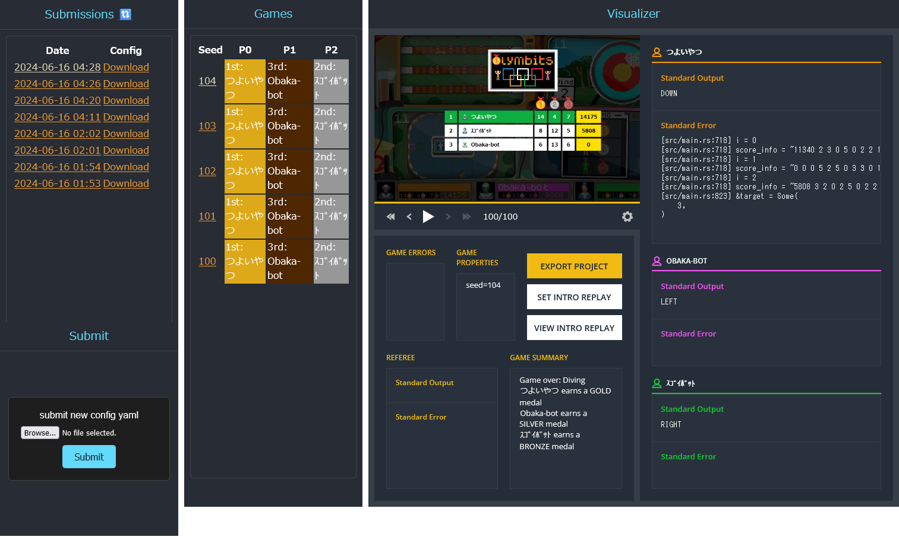

# Unofficial Local Visualizer for CodinGame Summer Challenge 2024 with Fiverr - Olymbitsa



## environment
openjdk-17-jdk, python3.10

## usage
prepare and place `server/spring-2024-olympics-1.0-SNAPSHOT-jar-with-dependencies.jar` (see jar_generator)  

initialize visualizer assets in `server/visualizer`  
```
python generate_assets.py
```

start server
```
python server.py
```

make `game_config.yaml` and submit from submit pane  
or just run
```
python runner.py game_config.yaml
```