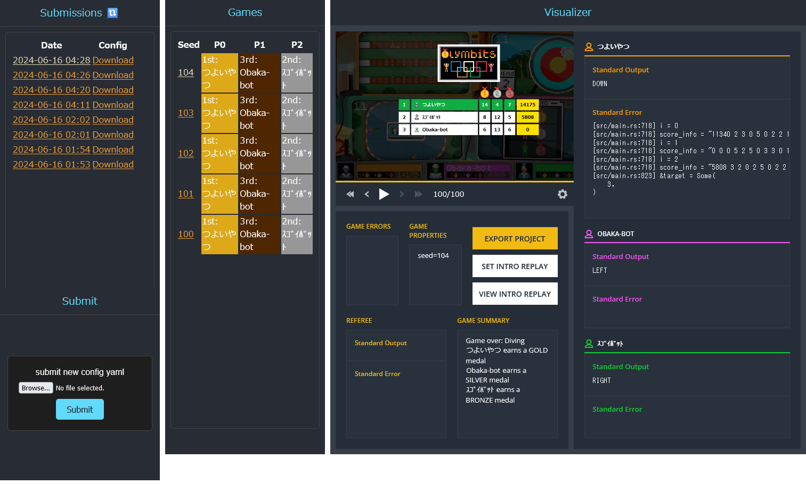

# Unofficial Local Visualizer for CodinGame Summer Challenge 2024 with Fiverr - Olymbitsa



## environment
openjdk-17-jdk, python3.10

## usage
build official codingame repository (see [jar_generator](jar_generator))  
```
cd jar_generator
docker compose up
```

place `server/spring-2024-olympics-1.0-SNAPSHOT-jar-with-dependencies.jar`   

```
cp output/*.jar ../server/
```

initialize visualizer assets in `server/visualizer`  
```
cd ../server
pip install -r requirements.txt
python generate_assets.py
```

start server
```
python server.py
```

open visualizer [http://localhost:8000/]() (default port is 8000. check the last line of server.py) 

make `game_config.yaml` and submit from submit pane OR run
```
python runner.py game_config.yaml
```

## config
example `game_config.yaml`
```
threads: 1 # num processing threads ( cpu / players ? )
level: 3   # league level. Wood2 => 1, Wood1 => 2, Silver => 3
seed: 1    # start seed of games. [seed..seed+games]  
games: 5   # number of games for each player pairs
description: ''

# match mode
#   all: round-robin tournament. for each (i<j<k): (player_i vs player_j vs player_k) * games
mode: all
#   vs0 # player_0 vs (other players combination) * games
# mode: vs0

# player(bot) list
# the first player is `player 0`
players:
- name: A # bot name
  exec: python a.py # execution command
  description: ''

- name: B
  exec: python a.py
  description: ''

- name: C
  exec: python a.py
  description: ''
```
